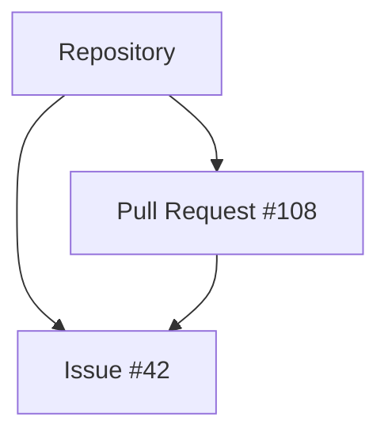

# :books: Core Concepts

Before exploring individual API endpoints, it’s important to understand the core objects that power the GitHub Repository Management API.

This section introduces the three foundational concepts:

- **Repositories**
- **Issues**
- **Pull Requests**

Understanding how these entities relate to one another will make the API much easier to use.

---

## Repositories

A **repository** is the central container for a software project.

It stores:

- Source code  
- Documentation  
- Configuration files  
- Issue tracking data  
- Pull requests  

Every repository belongs to:

- A **user account**, or  
- An **organization**

### Key Characteristics

- Can be **public** (visible to everyone) or **private**
- Has a unique `name` within its owner’s namespace
- Has a default branch (typically `main`)
- Can be forked by other users
- Supports issue tracking and pull requests

### Why Repositories Matter

In the API, most operations are scoped to a repository.

For example:

- Listing issues in a repository  
- Creating a pull request  
- Updating repository settings  

Repositories act as the **top-level resource** in most API paths: `/repos/{owner}/{repo}`

---

## Issues

An **issue** represents a task, bug report, feature request, or discussion related to a repository.

Issues help teams track and organize work.

### Key Characteristics

- Belong to a single repository
- Have a required `title` and optional `body`
- Can be **open** or **closed**
- Can be assigned to users
- Can have labels (e.g., `bug`, `enhancement`)
- Support comments and discussions

While GitHub technically enforces only `open` and `closed` states, teams often implement structured workflows using labels and automation.

## Why Issues Matter

Issues are often the starting point of development work.

They provide context for:

- Code changes  
- Pull requests  
- Team discussions  

Many API integrations use issues to automate:

- Ticket synchronization  
- Project tracking  
- Notifications  

---

## Pull Requests

A **pull request (PR)** is a proposal to merge changes from one branch into another.

Pull requests are the foundation of collaborative development.

## Key Characteristics

- Belong to a repository  
- Compare two branches:
  - **Base branch** (target branch)
  - **Head branch** (source branch)
- Can be **open**, **closed**, or **merged**
- Support reviews and comments
- Can reference related issues  

Pull requests often reference issues using keywords like: `Closes #123`

When merged, the linked issue can automatically close.

## Why Pull Requests Matter

Pull requests provide:

- Code review capability  
- Collaboration controls  
- Traceability between issues and code changes  

In the API, pull requests allow integrations to:

- Automate merge checks  
- Track review status  
- Trigger deployment workflows  

---

## How These Concepts Connect

These three entities work together within a repository:

- A **repository** contains issues and pull requests  
- An **issue** tracks a piece of work  
- A **pull request** proposes the code change that resolves the issue  

The relationship can be visualized as:

Understanding these relationships is essential before working with the API endpoints in the next section.

---

# What’s Next?

Now that you understand the core concepts, you can:

- Continue with Getting Started to learn about authentication and rate limits
- Explore the Workflows section for real-world usage examples
- Dive into the API Reference for detailed endpoint documentation