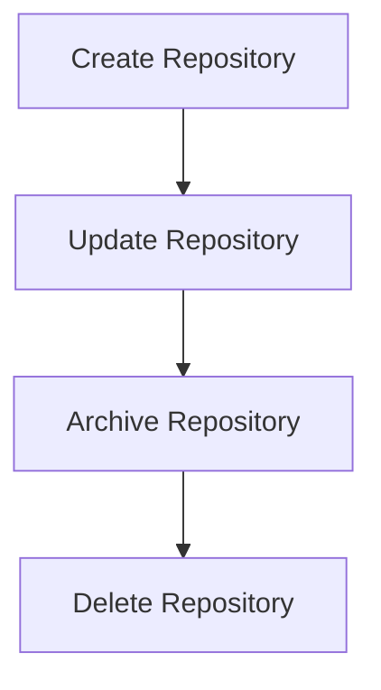
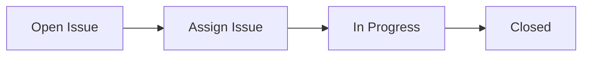
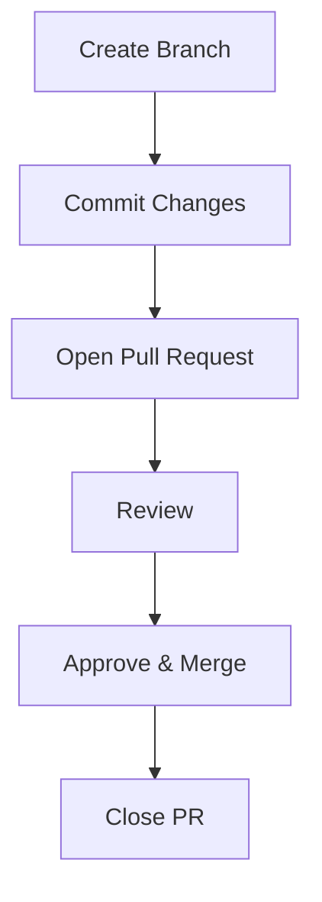

# Workflows

This section demonstrates **common end-to-end workflows** in the GitHub Repository Management API.  
Diagrams help explain how repositories, issues, and pull requests interact over time.

---

## Repository Lifecycle

A repository typically follows these stages:

- **Create** → Initialize a new repository  
- **Update** → Modify settings, rename, or add collaborators  
- **Archive** → Make the repository read-only  
- **Delete** → Permanently remove the repository  

Diagram:

---

## Issue Workflow

Issues track work items from start to finish:

- **Open** → A new issue is created  
- **Assign** → Team members are assigned  
- **In Progress** → Work is underway  
- **Closed** → Issue is resolved or completed  

Diagram:

---

## Pull Request Workflow

Pull requests propose code changes and often relate to issues:

- **Create Branch** → Start a new feature or bug fix  
- **Commit Changes** → Make code modifications  
- **Open PR** → Submit the pull request  
- **Review** → Team reviews the code  
- **Approve & Merge** → Merge changes into the base branch  
- **Close PR** → Optional, if PR is rejected or superseded  

Diagram:

